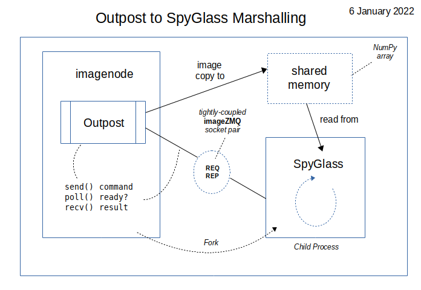
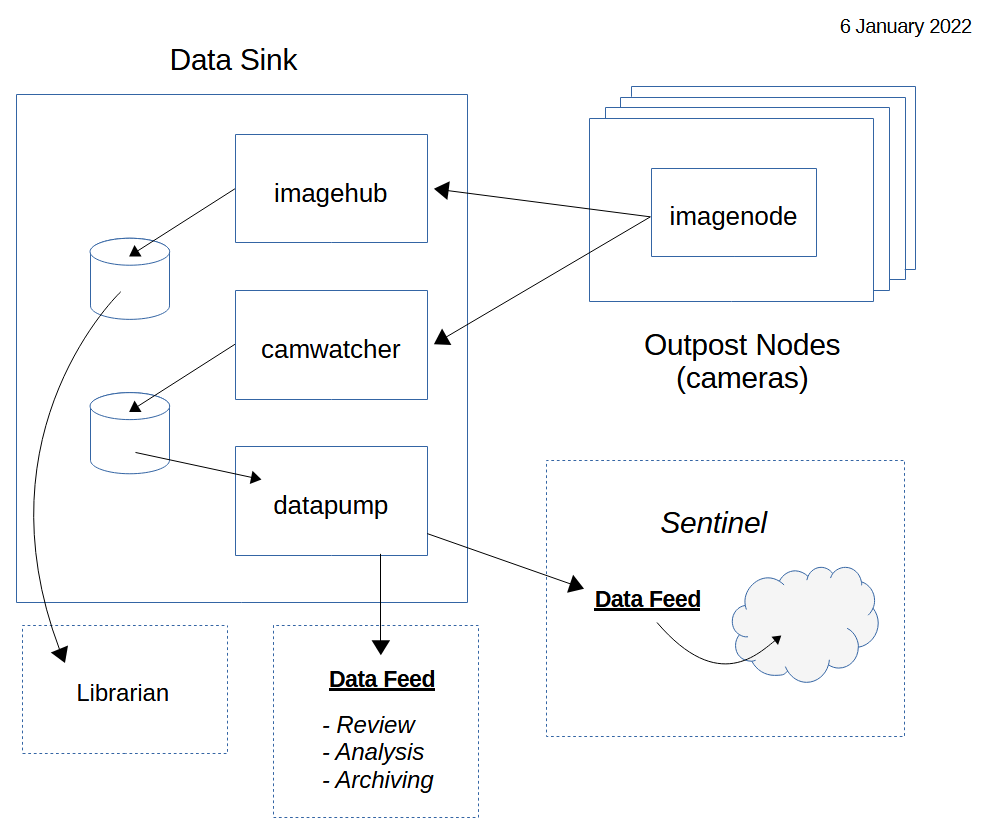
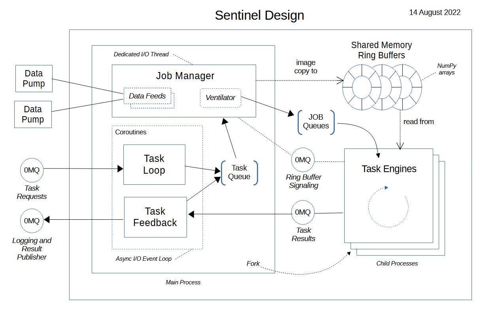

=================================================
sentinelcam: Vision and machine learning pipeline
=================================================

Introduction
============

**SentinelCam** is an unfinished work in progress. The project goal is to develop a small-scale
distributed facial recognition and learning pipeline hosted on a network of Raspberry Pi computers.
The practical application for this is to build a stand-alone embedded system served by multiple
camera feeds that can easily support presence detection within the context of smart home automation.

.. contents::

Initial project goals
=====================

Early project goals are to be able to recognize people and vehicles that are known to the house.
Differentiating between family, friends, guests, neighbors, *and strangers*. Identifying package and 
mail delivery. Knowing when a strange car has pulled into the driveway.

Significantly, any unknown face should automatically be enrolled and subsequently recognized going 
forward. Unknown faces can always receive a "formal introduction" later by tagging and categorizing
as desired.

- Able to operate independently of any cloud-based services or externally hosted infrastructure 
- Automatic video capture should be triggered by motion detection and stored for review/modeling
- Motion detector will provide basic object tracking for the duration of the event
- Object identifiers and associated tracking centroids are logged as an outcome of motion detection
- A live video feed from each camera must be available for on-demand viewing as desired  
- Video playback should support an optional timestamp and any desired labeling of inference results
- Optional time-lapse capture 

High-level design concept
=========================

The birds-eye overview of the early conceptual framework is portrayed by the following sketch. 

Multiple **Outposts** are each a camera node. These are not rigged with internal disk storage.
One or more *data aggregators* are responsible for accumulating reported data and capturing
video streams. 

Realtime analysis of logged data from each **Outpost** feeds a *dispatcher* responsible for
submitting tasks to the **Sentinel**. Inference and labeling tasks should be prioritized over
modeling runs. The **Sentinel** will need to be provisioned with adequate memory and computing
resources. 

.. image:: docs/images/SentinelCamOverview.png
   :alt: SentinelCam conceptual overview

One of the biggest challenges to implementing a workable solution to this problem, operating 
over a network of small single board computers such as the Raspberry Pi, is making effective 
use of the limited resources available.

This is best served by a "divide and conquer" approach. Spread out the workload for efficiency,
employing parallelization where helpful for processing incoming data sets. Keep overhead to a 
minimum. Each node in the network should serve a distinct purpose. Take care, do not overburden 
any individual node, while watching out for untapped idle capacity. Orchestration is key. Balance
is required.

Although each **Outpost** node operates independently, any detected event could be directly
related to an event being simultaneously processed by another node with an overlapping or 
adjacent field of view.

Object tracking references and related timestamps become the glue that ties inference results
back to the original source video streams. 

   Ideally, this would be something hidden away in walls, cabinets and closets... and 
   then mostly forgotten about. Because it will just work, with limited care and feeding. 
   *Dream big, right?* 

Leveraging imagenode
====================

Fortunately, early research led to the `imageZMQ <https://github.com/jeffbass/imagezmq>`_ 
library authored by Jeff Bass. This was key to resolving data transport issues between
nodes. 

For building out the functionality of the **Outpost**, it quickly became obvious that 
Jeff's **imagenode** project could provide scaffolding that was both structurally sound and 
already working. This project has been forked as a submodule here. Additional details 
regarding enhancements are documented in `YingYangRanch_Changes <docs/YingYangRanch_Changes.rst>`_.

Most significantly, this enhanced **imagenode** module completely encapsulates all the
functionality required by the **Outpost**, while continuing to serve in its existing
role.

Project status
==============

**SentinelCam** is an incomplete, and largely experimental, work in progress. 

Outpost design
--------------

Imagine a lonely sentry standing guard at a remote outpost. Each outpost is positioned to watch over
the paths leading towards the inner fortifications. Sentries are tasked with observing, monitoring,
and reporting anything of interest or concern. Such reports should be sent back to central command
for analysis and decision making.

This analogy represents the underlying concept behind the ``Outpost`` design. Each node monitors the
field of view, watching for motion. Once motion has occurred a ``SpyGlass`` is deployed for a closer
look. Whenever one or more recognizable objects have been detected, this is reported and motion through
the field of view tracked and logged.

The ``Outpost`` is implemented as a ``Detector`` for an **imagenode** camera. This allows it to easily
slip into the existing **imagenode** / **imagehub** / **librarian** ecosystem as supplemental functionality.

Two key enhancements provide the essential wiring to make this possible. Log and image publishing over 
ZeroMQ and imageZMQ respectively.

  *Image publishing has a twofold benefit*

- Image capture from another node can be quickly initiated by an event in progress.
- A live stream can simultaneously feed one or more monitors for on-demand real time display.

Images are transported as individual full-sized frames, each compressed into JPEG format. For 
smooth realistic video playback, the pipeline needs to run with a target throughput of somewhere 
close to 30 frames per second, ideally.

Obtaining this goal on a Raspberry Pi can quickly become a significant challenge when building out 
the pipeline with CPU-intensive tasks such as object identification and tracking.

To achieve the highest publishing frame rate possible, an ``Outpost`` node can employ a ``SpyGlass`` 
for closer analysis of motion events. The idea is to keep the pipeline lean for quickly publishing 
each frame, while processing a subset of the images in parallel to drive a feedback loop. 
This is a multiprocessing solution. 

  **Status**: stable working prototype.  

The following general strategy provides an overview of this technique.

- Motion detection is applied continually whenever there is nothing of interest within the field
  of view. This is a relatively quick background subtraction model which easily runs within the main 
  image processing pipeline.
- A motion event triggers the application of an object identification lens to the spyglass.
- Each object of interest is tagged for tracking.
- With objects of interest in view, a tracking lens is applied to subsequent frames whenever the 
  spyglass is not already busy.
- Object identification is periodically reapplied to refresh the tracking data.
- The newest image passing through the pipeline is only provided to the spyglass after results 
  from the prior task have been returned. This signals its availability for new work.

This architecture potentially allows for increasingly sophisticated vision analysis models to be
deployed directly on an ``Outpost`` node. Specialized lenses could be developed for the ``SpyGlass``
based on the type of event and results from current analysis. The intent is to support the design
of a cascading algorithm to first inspect, then analyze a subset of selected frames and regions of
interest as efficiently as possible on multi-core hardware.

For example, if a person was detected, is there a face in view? If so, can it be recognized? Was it
package delivery or a postal carrier? If the object of interest is a vehicle, can the make/model be
determined? The color? Is there a license plate visible?

As a general rule, in-depth analysis tasks such as these are assigned to batch jobs running on the
**sentinel** itself.

  *Log publishing also offers two benefits*

- Allows error and warning conditions to be accumulated in a centralized repository as they occur.
  This avoids reliance on SD cards with limited storage capacity which could be dispersed across 
  potentially dozens of individual camera nodes.

- More importantly, logged event notifications including information related to an event in progress
  are then available as data which can be streamed to multiple interested consumers in real time.

The ``Outpost`` as currently implemented is still considered experimental, and best represents proof 
of concept as an evolving work in progress. Further detail on the design, structure, and operation of
the ``Outpost`` have been documented in `YingYangRanch_Changes <docs/YingYangRanch_Changes.rst>`_.

Camwatcher design
-----------------

A prototype of the **camwatcher** functionality is up and running in production. Early design goals 
for this module have been met. This key component has proven to be a stable proof of concept. 
See below for a high-level design sketch.

.. image:: docs/images/CamWatcher.png
   :alt: Sketch of basic camwatcher design

Depending on how many camera events are occuring at any one time, each **camwatcher** node can support 
a limited number of ``Outpost`` publishers. As the total number of deployed camera nodes increase, 
additional data sinks will need to be included in the system architecture design to distribute the load.

  **Status**: stable working prototype.  

- Image publishing over imageZMQ supports multiple subscribers concurrently. Event analysis and 
  image capture can occur, while simultaneously supporting a live camera feed on one or more video 
  displays. 

- Log publishing over ZeroMQ has also proven to be very effective. The **camwatcher** design
  exploits this in a couple of ways. One is for responding to activity being reported from the
  ``Outpost`` nodes in a real time manner. Additonally, task results from analysis running on 
  the **sentinel** are collected using this same technique. See the ``sentinel`` setting in the 
  `camwatcher.yaml <camwatcher.yaml>`_ file for how this is configured.

The *CSV File Writers* run as dedicated I/O threads. This component is responsible for receiving 
queued data records and writing them into CSV-format text files based on the following data model.

Data model
----------

The data model is beginning to stabilize, though continues to evolve. Two types of data are collected
by the **camwatcher**. Data related to the analysis of the event and captured images. All 
data is stored in the filesystem, within a separate folder for each category. 

Event tracking data and results from event analysis are written to the filesystem as a set of 
CSV-format text files. For each date, there is an event index file and a separate file with
the detailed result sets from each analysis task executed for the event.

The index file for each date folder is named ``camwatcher.csv`` as described below. There is no 
header row included in the data. All dates and timestamps reflect Coordinated Universal Time (UTC), 
rather than the local time zone.

.. csv-table:: Event Index 
  :header: "Name", "Type", "Description"
  :widths: 20, 20, 60

  node, str, node name  
  viewname, str, camera view name 
  timestamp, datetime, timestamp at the start of the event
  event, str, unique identifer for the event 
  width, int, width of captured images
  height, int, height of captured images
  type, str, tracking result type 

Event detail files always include a header row, with potentially varying data structures depending 
on the type of result data. The following record description is currently used by all event tracking 
result sets. The naming convention for these detail files is: ``EventID_TypeCode.csv``

.. csv-table:: Tracking Event Detail
  :header: "Name", "Type", "Description"
  :widths: 20, 20, 60

  timestamp, datetime, timestamp for the image
  objid, str, object identifier
  classname, str, classification name
  rect_x1, int, bounding rectangle X1-coordinate
  rect_y1, int, bounding rectangle Y1-coordinate
  rect_x2, int, bounding rectangle X2-coordinate
  rect_y2, int, bounding rectangle Y2-coordinate

These CSV files are written into the folder specified by the ``csvfiles`` configuration 
setting in the `camwatcher.yaml <camwatcher.yaml>`_ file, and organized by date into subfolders 
with a YYYY-MM-DD naming convention.

Although identifiers are unique, event data is always referenced by date. There is no event 
index crossing date boundaries. 

.. code-block:: 

  camwatcher
  ├── 2021-02-11
  │   ├── camwatcher.csv
  │   ├── 0b98da686cbf11ebb942dca63261a32e_trk.csv
  │   ├── 109543546cbe11ebb942dca63261a32e_trk.csv
  │   ├── 1fda8cb26cbd11ebb942dca63261a32e_trk.csv
  │   ├── 202cda206cbe11ebb942dca63261a32e_trk.csv
  │   ├── 7bf2ba8c6cb911ebb942dca63261a32e_trk.csv
  │   ├── a4f355686cbe11ebb942dca63261a32e_trk.csv
  │   ├── cde802a06cc011ebb942dca63261a32e_trk.csv
  │   ├── d1995d346cb811ebb942dca63261a32e_trk.csv
  │   └──  # etc, etc. for additional events
  ├── 2021-02-12
  │   ├── camwatcher.csv
  │   ├── 11ddcf986d6211ebb942dca63261a32e_trk.csv
  │   ├── 1af4aac66d5c11ebb942dca63261a32e_trk.csv
  │   ├── 1dd50b3a6d4a11ebb942dca63261a32e_trk.csv
  │   ├── 27f4b4686d3f11ebb942dca63261a32e_trk.csv
  │   ├── 3ce8389c6d3d11ebb942dca63261a32e_trk.csv
  │   └──  # etc, etc. for additional events
  │
  └──  # additional directories for each date

Captured images are written to the filesystem as individual full-sized frames 
compressed into JPEG files. These files are written into the folder specified 
by the ``images`` configuration setting in the `camwatcher.yaml <camwatcher.yaml>`_ 
file, and organized by date into subfolders with a YYYY-MM-DD naming convention.

This convention allows for retrieval and storage that is both fast and efficient 
on such small devices. Analysis tasks have speedy direct access to any desired 
event and point in time. The price paid for this includes a little extra network 
bandwidth when pulling the images down, and disk storage requirements which are 
best characterized as greedy. *Very greedy*.

The file name convention for each stored frame is: ``EventID_TimeStamp.jpg`` as 
portrayed below.

.. code-block:: 

  images
  ├── 2021-02-11
  │   ├── 109543546cbe11ebb942dca63261a32e_2021-02-11_23.08.34.542141.jpg
  │   ├── 109543546cbe11ebb942dca63261a32e_2021-02-11_23.08.34.572958.jpg
  │   ├── 109543546cbe11ebb942dca63261a32e_2021-02-11_23.08.34.603971.jpg
  │   ├── 109543546cbe11ebb942dca63261a32e_2021-02-11_23.08.34.635492.jpg
  │   ├── ...
  │   ├── a4f355686cbe11ebb942dca63261a32e_2021-02-11_23.12.43.274055.jpg
  │   ├── a4f355686cbe11ebb942dca63261a32e_2021-02-11_23.12.43.305151.jpg
  │   ├── a4f355686cbe11ebb942dca63261a32e_2021-02-11_23.12.43.336279.jpg
  │   ├── a4f355686cbe11ebb942dca63261a32e_2021-02-11_23.12.43.367344.jpg
  │   ├── a4f355686cbe11ebb942dca63261a32e_2021-02-11_23.12.43.399926.jpg
  │   ├── a4f355686cbe11ebb942dca63261a32e_2021-02-11_23.12.43.429276.jpg
  │   ├── a4f355686cbe11ebb942dca63261a32e_2021-02-11_23.12.43.459129.jpg
  │   ├── a4f355686cbe11ebb942dca63261a32e_2021-02-11_23.12.43.490918.jpg
  │   └──  # etc, etc. for additional images
  ├── 2021-02-12
  │   ├── 11ddcf986d6211ebb942dca63261a32e_2021-02-12_18.42.33.998836.jpg
  │   ├── 11ddcf986d6211ebb942dca63261a32e_2021-02-12_18.42.34.028291.jpg
  │   ├── 11ddcf986d6211ebb942dca63261a32e_2021-02-12_18.42.34.060119.jpg
  │   ├── 11ddcf986d6211ebb942dca63261a32e_2021-02-12_18.42.34.093632.jpg
  │   ├── 11ddcf986d6211ebb942dca63261a32e_2021-02-12_18.42.34.124754.jpg
  │   ├── 11ddcf986d6211ebb942dca63261a32e_2021-02-12_18.42.34.154909.jpg
  │   └──  # etc, etc. for additional images
  │
  └──  # additional directories for each date

The collection of image data occurs independently from the tracking data. Some variation in the rate 
of capture can be expected, though these differences are not expected to be significant. There can also 
be minor differences between the clock times from one network node to another. Reporting around image 
analysis is designed to connect any results to the timestamp of the image when it was captured. 

DataPump and DataFeed
---------------------

Collecting and storing data are only steps one and two. What logically follows, is easy access
for analysis. Once tasked with event review, the **sentinel** will be hungry for images and 
any tracking records generated by the outpost.

This potentially ravenous fast-food style appetite is to be fed with requests to a 
``DataFeed``. The Data Feed was conceived as a library to provide application programs with 
functions for accessing any desired set of images and tracking data produced from an outpost 
and collected by a **camwatcher**.

Thus both the ``DataFeed`` and ``DataPump`` classes, along with the **datapump** module, were born. 
The **datapump** is the stand-alone server process which responds to Data Feed access requests
over the network. Communication between components is via imageZMQ using a REQ/REP socket pair. 

.. code-block:: python

  class DataFeed(imagezmq.ImageSender):  # REQ socket - sends requests to a DataPump 
  class DataPump(imagezmq.ImageHub):     # REP socket - responds to DataFeed requests

Any module needing access to **camwatcher** data simply needs to create a ``DataFeed`` instance. 
The network address for a running **datapump** process is specified at that time.

The ``DataFeed`` and ``DataPump`` subclasses extend the imageZMQ base classes with support 
for sending and receiving both pandas DataFrame objects, and lists of timestamps. Built upon 
the same serialization context underpinning imageZMQ, this helps maintain consistent image 
transport technology throughout the system.

Internally, the first element of the (text, data) tuple returned to the Data Feed has been 
reserved for carrying a yet-to-be-implemented response code from the **datapump**. 

  **Status**: working proof of concept, still evolving.  

.. code-block:: python

  DataFeed.get_date_index (date) -> pandas.DataFrame

The ``get_date_index()`` function returns the content of the Event Index for a date. The date
parameter is always required and specified in 'YYYY-MM-DD' format. There is no default value.
The Event Index data is returned as a ``pandas.DataFrame`` obect. Refer to the description of
the data model above for further detail.

.. code-block:: python

  DataFeed.get_tracking_data (date, event, type='trk') -> pandas.DataFrame

The first two arguments to the ``get_tracking_data()`` function are required, a date and an 
event identifier. Used to retrieve the full Tracking Event Detail dataset (see *Data model* above) 
as a ``pandas.DataFrame`` object. The date is specified in 'YYYY-MM-DD' format, the EventID 
reference must exist for the indicated date.

.. code-block:: python

  DataFeed.get_image_list (date, event) -> [timestamp]

This function provides a list of ``datetime.timestamp`` objects reflecting the capture times 
on images published by the Outpost. These are provided in chronological order. Function arguments 
are identical to what is described above for ``get_tracking_data()``.

All date and time references are in Coordinated Universal Time (UTC), not the local time zone.

.. code-block:: python

  DataFeed.get_image_jpeg (date, event, timestamp) -> bytes

Returns a buffer with the image frame as compressed JPEG data. Always for an existing date, 
event, and timestamp as described above. 

Presenting **camwatcher** data in this fashion provides the **sentinel** with direct access to 
specific subsets of captured image data. For example, perhaps the images of interest are  
not available until 3 seconds after the start of the event. This facilitates skipping
over the first 90-100 frames, for fast efficient access to the point of interest. 

Sentinel design
---------------

A working prototype of the **sentinel** module is up and running in production. Early design goals 
for this module have been met. The **sentinel** accepts job service requests as JSON over ZeroMQ.
Parallelization is provided by a multi-processing design, allowing multiple tasks to run at once. 
Employs a dedicated I/O thread to supply image requests for use in analysis tasks through a set of 
ring buffers in shared memory. 

The **sentinel** module is conceived as the primary inference and signaling center; the very 
heartbeat of the larger system. One or more dispatchers are responsible for firing events 
that are deemed worthy of deeper analysis by the **sentinel**. 

  **Status**: stable working prototype.  

Workloads are configured through a set of YAML files. Tasks can be configured by job class to 
have an affinity for a certain task engine. Perhaps one of the task engines has a dedicated 
inference co-processor and is kept ready for real-time supplemental event analysis.

- A separate engine can be used for work that only requires CPU, such as background 
  maintenance tasks.

- Workloads can be reconfigured during idle time periods, such as at night. With fewer camera
  events occurring, co-processors can be re-tasked for larger batch analytical sweeps of the data. 

- Configurable pipeline definitions are supported through task chaining and task aliasing.

See `sentinel.yaml <sentinel.yaml>`_ for an example of how this is configured. 

Research and development roadmap
================================

Development is proceeding along multiple paths simultaneously. The categories below do not
describe an all-inclusive list, they are simply interrelated areas of current focus. The 
conceptual framework driving the overall project is larger in scope. Updates are published
here on an incremental basis as new functionality is fleshed out, proven, and stabilized. 

Facial recognition and learning pipeline
----------------------------------------

For all machine learning aspects of SentinelCam related to computer vision, the system is
designed so that models are trained on data which has been collected by the deployed Outpost 
cameras. 

Strategy
........

There would seem to be broadly two strategies to follow when designing a facial recognition system. 

  1. Formal data collection accompanied by something like a "look here to be recognized" solution.
  2. Casual data collection and recognition based on a catch-as-catch-can philosophy. 

SentinelCam adopts the latter approach.

New individuals are learned through an on-going cycle of data collection and model refinement. 
This is a semi-supervised life cycle relying on human feedback for both confirming the identity 
of new individuals learned, and oversight into the health of the recognition model evolution 
process.

   The lofty goal is: limited care-and-feeding requiring only a bare minimum of human input and feedback.

For the initial stand-up of a new deployment, the system needs to be introduced to the persons
who should be known at start-up. This is best served by a conscious act of data collection. Such 
an effort would entail each individual spending some time standing alone in front of an Outpost node, 
facing the camera lens. Ideally, with good lighting for illumination of the images. This needs to 
allow for several seconds of elapsed time; including minor head movements and changes in direction
of gaze, perhaps while conversing with someone off-camera, to capture a variety of expressions. 
The more of this, the better. 

Challenges
..........

There are a number of inherent challenges to the SentinelCam design that must be overcome.

Partly this is related to infrastructure constraints. This system is designed to run on small 
low-voltage embedded devices, not in some high-end commercial data center, or within some virtual 
server farm in the clouds. The more CPU/GPU brought to bear, the more electricity needed to make
it all work.

*Frankly, though, infrastructure is not the only challenge*. Design philosophy presents a more 
complex set of obstacles. 

- High image publishing frame rates are required to provide full motion video for on-demand viewing 
  and collection for analysis and playback. The additional goal for providing, even limited, timely 
  response to events in progress further support that same constraint.
- Thus for efficient collection, transport, analysis, and storage of data: images must often be scaled 
  down to XGA or even VGA sizes.
  - *This, is where infrastructure constraints have the greatest impact*.
  - Detected faces within these resulting images can be quite small.
- Lighting conditions are rarely supportive of quality image collection, sometimes resulting in deep
  shadows and poor contrast.
- Except for when the subject is gazing directly at the camera, collected images often present profile 
  views and oblique perspectives.
- Persons may be actively moving through the field of view, and not stationary. This can sometimes 
  result in images containing motion artifacts resulting in blurry, apparently out of focus, faces.
- At high frame rates, a single Outpost event can potentially capture hundreds of images containing 
  facial data. Only a few of these images might result in a recognition result with high confidence. 
- A much smaller subset of those images might have the desired quality for use as feedback to improve
  the recognition model. 
- Sometimes, failures in recognition tasks result from the introduction of new individuals not seen 
  before. The system needs to be able to discern the difference, and attempt to remember each new person
  so that they can be recognized in the future.

Some of this can be alleviated with planning and forethought. Lighting and camera placement are obvious 
factors that, when given careful consideration, can greatly improve overall results.

Solution approach
.................

There are a triad of goals that need to be addressed. 

  1. Determining when an individual has been identified with confidence.
  2. Recognizing when a new person has been encountered.
  3. Selecting a set of candidate images for improving the recognition model.

SentinelCam uses facial embeddings produced by the `OpenFace <https://cmusatyalab.github.io/openface/>`_ deep 
neural network as the foundation for a solution. This model transforms a facial image into a set of numeric
embeddings which describe an 128-dimension unit hypersphere representing the face. These values support a 
comparison based on the Euclidean distance between two faces such that the greater the distance, the more 
likely they are taken from two different individuals. 

These embeddings are used to train an SVM classifier based on the face captures collected from known individuals. 

Whenever the probability of the determined result from the model falls below a confidence threshold, a measurement 
using an Euclidean distance calculation is implemented as an additional confirmation. Distance is evaluated against 
a baseline representation kept for each known individual. The fallback approach is implemented by a search for the 
closest comparable known face.

In turn, this distance metric then also helps to quickly identify and remember newly introduced faces.

Sentinel
--------

Outputs from **sentinel** task results can be applied in multiple ways. 

  Multiple methods for addressing those event publication needs which go out to the larger 
  world will also be important.
  
  - `MQTT` for use in applications such as Node-RED
  - `Twilio` for SMS messaging

Outpost
-------

Beyond simple object detection and tracking, some inference tasks can be pushed out to the
edge where appropriate and helpful. Applying more sophisticated models across a sampling
of incoming frames could help determine whether a motion event should be prioritized for
closer analysis by the **sentinel**. 

Additional performance gains can be achieved here by equipping selected ``Outpost`` nodes with
a coprocessor, such as the Google Coral USB Accelerator or Intel Neural Compute Stick. Proper
hardware provisioning can allow for running facial and vehicle recognition models directly on
the camera node. When focused on an entry into the house, any face immediately recognized would
not require engaging the **sentinel** for further analysis.

Essentially, this could enable a camera to provide data in real time for discerning between
expected/routine events and unexpected/new activity deserving of a closer look.

  Support for using an OAK camera from *Luxonis* as the primary data collection device has 
  recently been incorporated into the ``Outpost``. These devices are an "AI-included" camera 
  with an on-board VPU co-processor. 
  
  The **DepthAI** `software libraries <https://docs.luxonis.com/projects/sdk>`_
  provide for model upload and customizable pipelines. The prototype definition provided here 
  produces the following outputs from the camera.

  1. MobileNetSSD object detection on every frame
  2. The 640x360 RGB image data ready for OpenCV and passed into the **imagenode** pipeline as the main camera source
  3. The same image data encoded into JPEG, ready for publication to the **camwatcher**
  
  All 3 of these outputs are provided by the camera at 30 frames/second. The ``Outpost`` can easily 
  consume this and publish complete object detection results and captured JPEG data for storage by the
  **camwatcher**. 
  
  In a perfect world, the ``SpyGlass`` could be employed as a vehicle for specialized supplemental 
  vision processing during a camera event in progress. There are several interesting possibilities. 
  Further provisioning with a vision co-processor provides for an incredible amount of analytical
  performance directly on an embedded low-voltage edge device. 
  
  The prototype pipeline definition can be found in 
  `imagenode/imagenode/sentinelcam/oak_camera.py <https://github.com/shumwaymark/imagenode/blob/master/imagenode/sentinelcam/oak_camera.py>`_.
  See the `depthai.yaml <depthai.yaml>`_ file for the setups.

Data management
---------------

There are several aspects to data management. For starters, it's a challenge. These little
embedded devices are not generally regarded as high-performing data movers. Provisioning 
with Gigabit Ethernet network cabling and low power SSD storage over USB3 go a long way 
towards alleviating those concerns. 

  Complacency should be avoided here, it is easy to be deceived. These are still small devices,
  and this design has a way of keeping most nodes fully tasked. Always keep the basics in mind. 
  It is critically important to give due consideration to key factors such as CPU resources, 
  memory utilization, disk I/O, storage capacity, and network traffic. Each impact the others. 
  The penalties incurred due to missteps always seem to hit harder than anticipated. 
  
  As more and more Outpost nodes are added, additional data sinks will be required to support them.

Raw data gleaned from an Outpost event can be voluminous and detailed.

SentinelCam endeavors to always capture as much image detail as possible. As noted above 
in the data model discussion, individual image frames require much more space than a compressed 
video format. The computer vision technology underpinning this design is based on the analysis of
two-dimensional images. The intent is to capture high-resolution ground-truth data, reducing 
the likelihood that key details might be missed. This is helpful for analysis and modeling,
while also allowing for the production of high-quality full-motion archival videos. 

There can be multiple objects of interest moving through the field of view simultaneously. 
Collected logging data can include geometry, classification, and labeling. These datasets could 
represent the aggregated results inferred from multiple deep neural networks, both collected 
in real time by an Outpost node and analysis results produced by the Sentinel. 

It adds up in a hurry. *And the rest of the story...*

Much of it can be meaningless, trivial, forgettable, and simply not wanted. For example, 
imagine an outdoor camera with a view of both an entry into the home and the driveway. The 
occupants and their vehicles will pass in front of that camera multiple times per day.

  SentinelCam was conceived as a system providing real-time analysis of various camera events 
  as they are occurring. Not a long-term video archival and retrieval engine. 

  *Built to operate exclusively on low-voltage embedded devices like the Raspberry Pi*, there
  are a few assumptions baked-in to the design. One of these is that the primary data sinks 
  are assumed to be something simple, like a permanently mounted SSD card over USB3. More
  exotic options, such as high-capacity NAS systems, are certainly available. Just not assumed.

  Jeff's Librarian capitalizes on Unix utilities to periodically keep a central data store updated.
  A great idea. If desired, the SentinelCam data sinks could simply be hosted directly on a larger 
  high-capacity system. Though again, that should not be a requirement.

  What to keep, and why. That's the real question to be answered. Isn't it always?

  - All these collected images: incredibly valuable for model-building.
      For feeding the SentinelCam machine learning life cycle, this is the first order of business. 
  - For long-term storage, perhaps image data should be converted into a video format and moved elsewhere.
  - Why keep old video? For routine events, maybe there isn't much reason to keep it around long.
  - For unexpected and unusual events, maybe that data is retained. Perhaps even copied off-site immediately.
  - The beauty of SentinelCam, is that it knows the difference.

This all needs to be mostly automatic and self-maintaining. The goal is to build a system requiring only
the bare minimum of care and feeding. Ideally, set it up and forget about it. It should just work. 

*Saying it once more. Dream big*.

Librarian
---------

Begin to explore capitalizing on the functionality of the **librarian**  and its design philosophy 
as a vehicle to centralize knowledge and state.

Additional documentation
========================
- `Version History and Changelog <HISTORY.md>`_
- `Changes to imagenode project <docs/YingYangRanch_Changes.rst>`_
- `Development blog <https://blog.swanriver.dev>`_

Technology foundation
=====================

**SentinelCam** is being developed and tested on top of the following core technologies
and libraries.

- Raspberry Pi 4B
- Raspbian Buster
- Python 3.7
- OpenCV 4.1.1
- OpenVINO
- picamera
- Luxonis OAK-1
- Intel NCS2
- NVIDIA Jetson Nano DevKit
- Google Coral USB Accelerator
- imageZMQ
- ZeroMQ
- scikit-learn
- NumPy
- pandas
- papermill
- MessagePack
- Dlib
  
Acknowledgements
================

- Dr. Adrian Rosebrock and the PyImageSearch team; his book: *Raspberry Pi for Computer Vision* 
  has been an invaluable resource.
- Jeff Bass (imagezmq, imagenode, and imagehub); his outstanding work has allowed this project
  to get off to a fast start.
