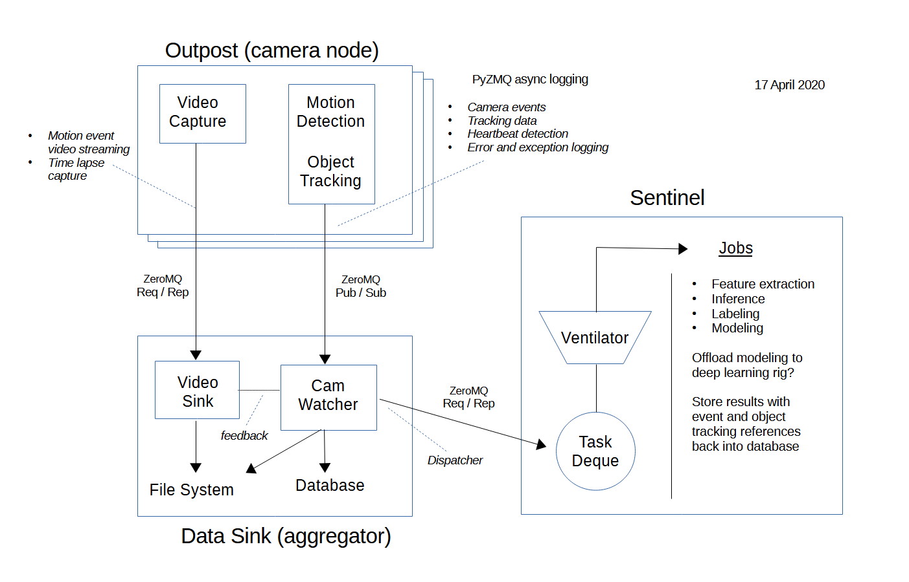
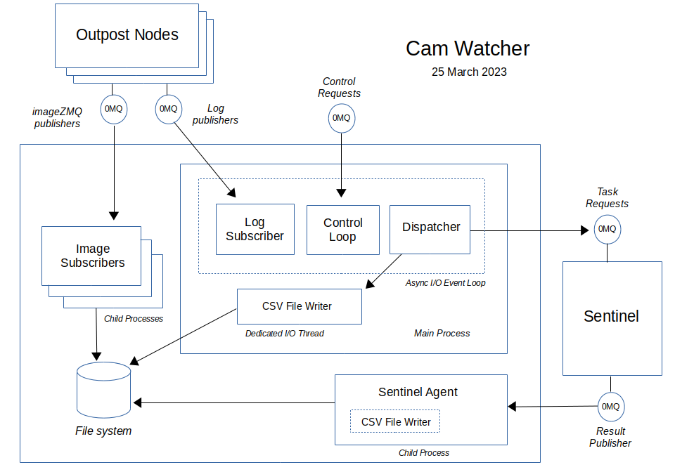

=========================================
sentinelcam: Smart Home Vision Technology
=========================================

Introduction
============

**SentinelCam** is an unfinished work in progress. The project goal is to develop a small-scale
distributed facial recognition and learning pipeline hosted on a network of Raspberry Pi computers.
The practical application for this is to build a stand-alone embedded system served by multiple
camera feeds that can easily support presence detection within the context of smart home automation.

.. contents::

Initial project goals
=====================

Early project goals are to be able to recognize people and vehicles that are known to the house.
Differentiating between family, friends, guests, neighbors, *and strangers*. Identifying package and 
mail delivery. Knowing when a strange car has pulled into the driveway.

Significantly, any unknown face should automatically be enrolled and subsequently recognized going 
forward. Unknown faces can always receive a "formal introduction" later by tagging and categorizing
as desired.

- Able to operate independently of any cloud-based services or externally hosted infrastructure 
- Automatic video capture should be triggered by motion detection and stored for review/modeling
- Motion detector will provide basic object tracking for the duration of the event
- Object ids and associated tracking centroids are logged as an outcome of motion detection
- A live video feed from each camera must be available for on-demand viewing as desired  
- Video playback should support an optional timestamp and any desired labeling of inference results
- Optional time-lapse capture 

High-level design concept
=========================

The birds-eye overview of the early conceptual framework is portrayed by the following sketch. 

Multiple *outposts* are each a camera node. These are not rigged with internal disk storage.
One or more *data aggregators* are responsible for accumulating reported data and capturing
video streams. 

Realtime analysis of logged data from each *outpost* feeds a *dispatcher* responsible for
submitting tasks to the *sentinel*. Inference and labeling tasks should be prioritized over
modeling runs. The *sentinel* will need to be provisioned with adequate memory and computing
resources. 

One of the biggest challenges to implementing a workable solution to this problem, operating 
over a network of small single board computers such as the Raspberry Pi, is making effective 
use of the limited resources available.

This is best served by a "divide and conquer" approach. Spread out the workload for efficiency,
employing parallelization where helpful for processing incoming data sets. Keep overhead to a 
minimum. Each node in the network should serve a distinct purpose. Take care, do not overburden 
any individual node, while watching out for untapped idle capacity. Orchestration is key.

Although each *outpost* node operates independently, any detected event could be directly
related to an event being simultaneously processed by another node with an overlapping or 
adjacent field of view.

Object tracking references and related timestamps become the glue that ties inference results
back to the original source video streams. 

Leveraging imagenode and imagehub
=================================

Fortunately, early research led to the `imageZMQ <https://github.com/jeffbass/imagezmq>`_ 
library authored by Jeff Bass. This was key to resolving data transport issues between
nodes. 

For building out both the *outpost* and **camwatcher** functionality, it quickly became 
obvious that his **imagenode** and **imagehub** projects could provide scaffolding that 
was both structurally sound and already working.

Both projects have been forked as submodules to the **SentinelCam** project. Further 
details on how these modules have been adapted is documented in
`YingYangRanch_Changes <docs/YingYangRanch_Changes.rst>`_.

Currently, the complete functionality of the **SentinelCam** *outpost* has been entirely
encapsulated by **imagenode**. 

Project status
==============

**SentinelCam** is an incomplete, and largely experimental, work in progress. 

Camwatcher design
-----------------

A first draft of the **camwatcher** functionality is up and running. In its current state, 
this is best evaluated as an early working proof of concept. The diagram below presents a
high-level design sketch.

This design exploits two modifications made to the **imagenode** module: log and video 
publishing over ZMQ as configurable options.

Logfile publishing serves two purposes. It first allows error and warning conditions to be
accumulated in a centralized repository as they occur. This avoids reliance on SD cards
with limited storage capacity which could be dispersed across potentially dozens of
individual camera nodes. More importantly, logged event notifications and information 
related to an event in progress are then available as data which can be streamed to multiple
interested consumers in real time.

Video publishing also has a twofold benefit. Not only can video capture be quickly triggered
by an event in progress, a live video stream can simultaneously feed one or more monitors for
display as desired.

The **camwatcher** employs a Python ``asyncio`` event loop running a set of coroutines with
the following tasks.

- *Control Loop*. Uses a ZMQ Req/Rep port for receiving control commands. This currently 
  just allows an **imagenode** to route a notification during initialization to insure that
  a logfile subscription has been established. 

- *Log Subscriber*. Subscribes to logging data streamed from one or more **imagenode**
  publishers via ZMQ. Logging data that pertains to a video event is directed to the 
  *Dispatcher* for handling. Any other data is passed to the **camwatcher** internal logger.

- *Dispatcher*. Handles object tracking event data. For each new event, a video stream 
  subscriber is instantiated to begin capturing the video. All event tracking data is queued
  for permanent storage by the *Database Writer*.

- *Database Writer*. Receives queued event tracking data and writes to the database.

This design packs a fair amount of I/O activity into a single thread of execution. To 
best exploit the multi-core architecture of the Raspberry Pi 4B, a child process is forked
to capture and store the published video stream from each detected tracking event.

Data model
----------

The data model is still in its infancy and is unlikely to survive in its current form.
The structures described below support the initial proof of concept for the high-level
design: all of which is subject to change.

Tracking data currently exists as a set of relational tables stored within a DBMS. 

.. code-block:: sql

   CREATE TABLE cam_event (
       node_name    VARCHAR(64),   -- Imagenode name
       view_name    VARCHAR(64),   -- camera view name
       start_time   TIMESTAMP,     -- event start time
       pipe_event   INTEGER,       -- pipeline event id at start
       pipe_fps     SMALLINT       -- pipeline velocity at start
   );

   CREATE TABLE cam_tracking (
       node_name    VARCHAR(64),   -- Imagenode name
       view_name    VARCHAR(64),   -- camera view name
       start_time   TIMESTAMP,     -- initial start time for event
       pipe_event   INTEGER,       -- can vary to support multiple events
       object_time  TIMESTAMP,     -- when motion was detected
       object_tag   INTEGER,       -- object identifier
       centroid_x   INTEGER,       -- object centroid X-coordinate
       centroid_y   INTEGER        -- object centroid Y-coordinate
   );

There is a one-to-many relationship between each ``cam_event`` record and rows of ``cam_tracking``
data. These two tables are joined on the columns ``node_name, view_name, start_time``.

Both tables have a ``pipe_event`` column. However, this value can vary within the tracking table
across any set of distinct motion events which have been associated with the same camera view and
starting time.

Captured video streams are written to the filesystem as individual image frames compressed into
JPEG files. These files are written into the folder specified by the ``outdir`` configuration
setting and organized by date into subfolders with a YYYY-MM-DD naming convention.

The file name convention for each stored frame is: NodeName_ViewName_EventID_FrameNumber.jpg

.. code-block:: 

  outdir
  ├── 2020-11-22
  │   ├── outpost_PiCamera_00169_0000000001.jpg
  │   ├── outpost_PiCamera_00169_0000000002.jpg
  │   ├── outpost_PiCamera_00169_0000000003.jpg
  │   ├── outpost_PiCamera_00169_0000000004.jpg
  │   ├── ...
  │   ├── outpost_PiCamera_00241_0000000383.jpg
  │   ├── outpost_PiCamera_00241_0000000384.jpg
  │   ├── outpost_PiCamera_00242_0000000001.jpg
  │   ├── outpost_PiCamera_00242_0000000002.jpg
  │   └──  # etc, etc. for additional images
  ├── 2020-11-23
  │   ├── outpost_PiCamera_00251_0000000001.jpg
  │   ├── outpost_PiCamera_00251_0000000002.jpg
  │   ├── outpost_PiCamera_00251_0000000003.jpg
  │   └──  # etc, etc. for additional images
  │
  └──  # additional directories for each date

The EventID and FrameNumber components of the filenames are zero-filled to a fixed length.
The intent behind this convention is to simplify grouping frames by date and event, and 
sorting them into sequence, while relying on the filesystem timestamp to associate each 
frame with an approximate point in time.

It is important to note that the capture rate for frames of video can vary significantly from
the rate of capture for the tracking data. To correlate tracking data back to a captured image,
it is necessary to bind these together by estimating an elapsed time from the start of the event 
for each data source.

Research and development roadmap
================================

Development is proceeding on several fronts simultaneously. The categories below do not
describe an all-inclusive list, they are simply interrelated areas of current focus. The 
conceptuaL framework driving the overall project is larger in scope. Updates are published
here on an incremental basis as new functionality is fleshed out, proven, and stabilized. 

Sentinel
--------

The *sentinel* module is conceived as the inference and modeling engine. This will ultimately
be the heart of the system. One or more *dispatchers* are responsible for firing events that
are deemed worthy of deeper analysis by the *sentinel*. 

Dynamic task scheduling of batch jobs is a critcal aspect of this. The ability to analyze 
ongoing events in something close to real time is of utmost importance. Therefore, inference
and labeling tasks are the highest priority; modeling and reinforcement more secondary. 

Outpost
-------

Beyond simple motion detection and object tracking, some inference tasks can be pushed out to
the edge where appropriate and helpful. Applying object identification across a sampling of
incoming frames could help determine whether a motion event is deserving of prioritized analysis
by the *sentinel*.

Taken a leap further, selected camera nodes can be equipped with a coprocessor such as the
Google Coral USB Accelerator or Intel Neural Compute Stick. This can allow for running a facial
recognition model directly on the *outpost* itself. When focused on an entry into the house,
any face immediately recognized would not require engaging the *sentinel* for further analysis.

Data management
---------------

There are two aspects to data management requirements: event analysis, and cataloging results.

For storing end results in a manner that facilitates effective retrieval, the primary concerns
are what happened when and can those determinations be easily associated back to the source 
video stream. 

Raw data gleaned from a video event can be voluminous and detailed, especially if analyzing each
individual frame. There can be multiple objects of interest moving through the field of view
simultaneously. Data elements collected could include the geometric centroid, bounding coordinates,
direction and velocity of travel, and a unique identifer for each object. Blended into this might
be the aggregated results inferred from one or more deep neural networks. Assuming an ideal video
capture rate of near 30 frames per second, this can obviously add up in a hurry.

Effective and efficient data analysis of a video event thus presents challenges. Current research
into a solution leans heavily towards a reliance on the pandas library as the vehicle of choice
for getting data into, and out of, each model. 

Video event playback
--------------------

The ability to easily select and review historical events and then present them within a video
player is an obvious requirement. This will ultimately evolve into a set of services to search 
for, list, and replay events that have been cataloged. 

Additional documentation
========================
- `Version History and Changelog <HISTORY.md>`_
- `Changes to imagenode and imagehub projects <docs/YingYangRanch_Changes.rst>`_
- `Development blog <https://blog.swanriver.dev>`_

Technology foundation
=====================

**SentinelCam** is being developed and tested on top of the following core technologies
and libraries.

- Raspberry Pi 4B
- Raspbian Buster
- picamera
- Python 3
- OpenCV 4
- PyZMQ
- imageZMQ
- imutils
- numpy
- pandas

Acknowledgements
================

- Dr. Adrian Rosebrock and the PyImageSearch team; his book: *Raspberry Pi for Computer Vision* 
  has been an invaluable resource.
- Jeff Bass (imagezmq, imagehub, and imagenode); his outstanding work has allowed this project
  to get off to a fast start.
