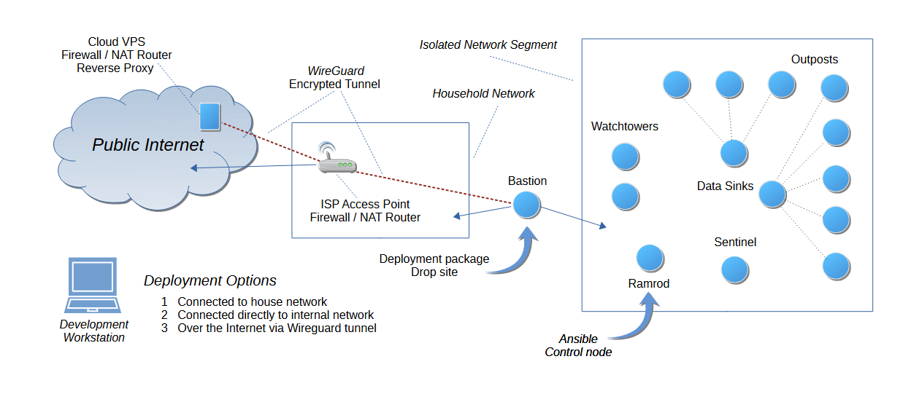

======================================================
SentinelCam: Development Operations and CI/CD Pipeline
======================================================

Philosophy
==========

The design for SentinelCam operations, and code transmission pipeline, speaks to the need for an isolated network development
workflow which can integrate with, and bolster, automated day to day operations on embedded infrastructure in production.
Ansible was selected as the deployment automation tool due to its lightweight nature, SSH-based operation, and minimal resource
footprint on constrained single-board computers (SBCs) such as the Raspberry Pi.

Deployment is testing
----------------------
In traditional software development, testing precedes deployment. However, in resource-constrained environments with specialized
hardware, deployment *becomes* the primary testing mechanism. SentinelCam operates on single-board computers performing real-time
vision processing and model inference in an isolated network. These conditions cannot be fully replicated in development
environments.

**Testing through deployment means:**

- **Real hardware validation**: Code runs on actual Raspberry Pi, Depth AI, and Jetson Nano devices, not emulated environments
- **Live network conditions**: Actual network latency, bandwidth constraints, and node communication patterns
- **Physical sensor interaction**: Real cameras, motion detection, and environmental conditions
- **Resource constraints**: Genuine memory pressure, CPU limitations, and storage constraints
- **System integration**: Services interact with actual systemd, network interfaces, and file systems

The deployment pipeline provides **rollback safety** rather than pre-deployment test gates, recognizing that the only meaningful
test is whether the system operates correctly in production. This approach prioritizes:

1. **Rapid iteration**: Deploy changes quickly to real hardware
2. **Observable behavior**: Monitor actual system operation
3. **Safe experimentation**: Automatic rollback checkpoints before every deployment
4. **Reality-based validation**: Human observation of real system behavior

Given these contraints and requirements, a robust yet lightweight deployment pipeline is essential.

Architecture
============

The SentinelCam deployment pipeline consists of four primary infrastructure components:

  1. **Development Workstation**: Laptop or desktop where code development occurs
  2. **Bastion Host**: Network bridge and temporary transfer cache
  3. **Primary Data Sink**: Storage hub and primary source repository
  4. **Ramrod Node**: Ansible controller and deployment engine

Development Workstation
-----------------------
The development workstation is where SentinelCam code is authored and initially packaged for deployment. This could be a Windows,
macOS, or Linux laptop, or a virtual machine, which would typically run an IDE such as Visual Studio Code and publish via Git.

**deploy.py** is the main script used to create a deployment package and send it to the bastion host. A YAML based configuration
file defines the structure and content of individual packages. Multiple components can be specified via command line arguments
which are then combined into a single package for transfer.

**Key Features:**

- Creates a timestamped deployment package containing selected components
- Validates package structure before transfer
- Transfers packages to bastion host via SCP or SFTP
- Supports incremental deployments (single component) or full system deployments
- Logs all deployment activities with timestamps
- Automatically triggers downstream pipeline steps upon successful transfer

**Filesystem structure:**

.. code-block::

  sentinelcam/
  ├── imagenode/
  ├── camwatcher/
  ├── sentinel/
  ├── watchtower/
  ├── devops/
  │   ├── ansible/
  │   └── scripts/
  │       └── sync/
  │           ├── deploy.py                # Create deployment package and send to bastion
  │           └── deployment-config.yaml
  ├── docs/
  ├── modeling/
  ├── imagehub/
  └── librarian-prototype/

Bastion Host
------------
The bastion host serves as a secure intermediary between the outside world and the internal network. It receives deployment packages from
the development workstation and temporarily stores them before transferring to the primary data sink.

- **Role**: Temporary staging for deployment packages
- **Storage**: Small cache for active transfers
- **Security**: SSH-based access control, provides isolation of production network

**process-code-upload.sh** is the main script that runs on the bastion host to handle incoming deployment packages. It validates the integrity of received packages,
stores them in a transfer cache, and forwards them to the primary data sink. This is triggered automatically by the **deploy.py** script on the development
workstation upon successful package upload.

**Key Functions:**

- Receives deployment packages from development workstation via SCP/SFTP
- Validates package integrity (checksums, format verification)
- Temporarily stores packages in transfer cache
- Forwards validated packages to primary data sink
- Maintains transfer logs for audit trails
- Triggers execution of the **integrate-code-update.sh** script on the primary data sink
- Automatically cleans up processed packages

The bastion host acts as a security boundary, ensuring that only validated deployment packages enter the internal network. It prevents direct access to
production systems from external development environments.

**Filesystem structure:**

.. code-block::

  /home/rocky/
  ├── transfer_cache/
  │   ├── incoming/                 # From workstation
  │   ├── processed/                # Previously handled packages
  │   └── logs/                     # Transfer logs
  └── scripts/
      └── process-code-upload.sh    # Process incoming uploads

Primary Data Sink
-----------------
Most sentinelcam nodes have minimal local storage, hosting an entire operating system on only a microSD card. The data sinks, however, are equipped with
large-capacity solid state disk (SSD) drives to serve as centralized repositories for images, collected data, and logfiles. The primary data sink (data1)
also functions as the authoritative source repository for all SentinelCam code and deployment artifacts.

Deployment packages arriving from the bastion host are integrated into the data sink's repository structure. The data sink maintains a history of previous
deployment packages to facilitate rollback if needed. The data sink also hosts master copies of the complete DevOps toolchain, including Ansible playbooks
and support scripts.

**integrate-code-update.sh** is the main script that runs on the primary data sink to process incoming deployment packages. It validates and integrates new packages
into the repository, preserving previous packages for rollback safety. Upon successful integration, it notifies the ramrod node to initiate deployment to target nodes.

**Filesystem structure:**

.. code-block::

  /home/ops/
  ├── camwatcher/                      # Currently running camwatcher and datapump services
  │   ├── camwatcher/
  │   └── datapump/
  ├── imagehub/                        # Currently running imagehub service
  │   └── imagehub/
  ├── sentinelcam/                     # SSD mount point
  │   ├── backups/                     # Backup snapshots of previous source and devops repositories
  │   ├── current_deployment/          # Repository for currently deployed source code
  │   │   ├── imagenode/
  │   │   ├── imagehub/
  │   │   ├── camwatcher/
  │   │   ├── sentinel/
  │   │   └── watchtower/
  │   ├── model_registry/              # Model repository for sentinel and imagenode
  │   ├── devops/                      # Complete DevOps toolchain
  │   │   ├── ansible/                 # Deployment and operational automation
  │   │   └── scripts/                 # Support scripts
  │   ├── staging/                     # Package drop area
  │   │   └── incoming/
  │   ├── logs/                        # System and deployment logging
  │   ├── camwatcher/                  # Collected CSV data from camwatcher and sentinel
  │   ├── images/                      # Collected JPEG data from camwatcher
  │   └── imagehub/                    # Data store for imagehub and librarian
  │       ├── images/
  │       └── logs/
  └── scripts/
      └── integrate-code-update.sh     # Integrate new package into current deployment

The ramrod control node
-----------------------
The ramrod node orchestrates Ansible deployments to all target nodes in the network and drives SentinelCam operations.
The latest copy of the DevOps toolchain from the primary data sink is pulled via SSH when deployment is initiated.
The ramrod node maintains a synchronized mirror of the `devops/` directory structure but does not permanently store source code.
It pulls fresh copies of this during each deployment cycle to ensure consistency with the authoritative repository on data1.

**Key Functions:**

- Pulls complete DevOps toolchain from data1 via SSH on-demand
- Executes Ansible playbooks to deploy to target nodes
- Maintains deployment logs and operational state
- Provides centralized control point for all node operations
- Minimal persistent storage - primarily configuration, scripts, and logs

- **Role**: Ansible execution, minimal local storage
- **Storage**: Lightweight, pulls configuration from data1 via SSH only when deploying

**Filesystem structure:**

.. code-block::

  /home/pi/
  └── sentinelcam/
      └── devops/               # Mirror of devops structure from data sink repository
          ├── ansible/
          │   ├── inventory/
          │   ├── playbooks/
          │   ├── roles/
          │   ├── logs/
          │   └── ansible.cfg
          └── scripts/
              ├── ansible/
              ├── deployment/
              └── sync/
                  └── sync-ramrod-from-datasink.sh  # Main sync script

Workflow and Package Lifecycle
==============================

This architecture supports a streamlined workflow for code development, package deployment, and system operation:

1. **Package Drop**: Bastion receives `.zip` from workstation
2. **Stage Incoming**: Package extracted to `incoming/` on data sink
3. **Preserve Current**: Current package moved to `previous/` (rollback safety)
4. **Promote New**: Incoming package becomes new `current/`
5. **Deploy**: Ramrod deploys from `current/` via Ansible
6. **Validate**: Manual verification that systems are stable
7. **Result**: Keep deployment OR rollback to `previous/` if problems

Further Reading
===============

- `Ansible Deployment Guide <ansible/README.md>`_ - Playbooks, roles, and inventory
- `DevOps Documentation Index <docs/README.md>`_ - Detailed documentation references
