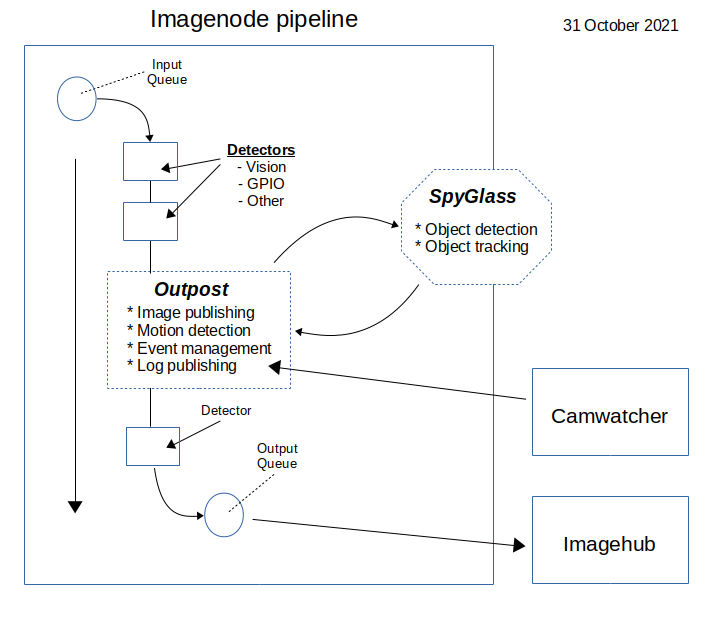

# Outpost History

How the **Outpost** got here: what it inherited from the **imagenode** project, what
SentinelCam added, and what the original motion-driven design looked like before the
§4.10 redesign replaced it.

This is a record, not a reference. Except where explicitly marked **still current**,
everything described below has been retired. For how an outpost works and is configured
today, see:

- [TRACKING_ARCHITECTURE.md](TRACKING_ARCHITECTURE.md) — the lifecycle and state machine
- [OUTPOST_CONFIGURATION.md](OUTPOST_CONFIGURATION.md) — every current setting
- [EVENT_PROTOCOL.md](EVENT_PROTOCOL.md) — the wire contract

---

## 1. The inheritance

SentinelCam did not start from an empty directory. Early research turned up
[imageZMQ](https://github.com/jeffbass/imagezmq) by Jeff Bass, which settled the
question of how to move images between nodes. His **imagenode** / **imagehub** /
**librarian** suite went further: working solutions for camera capture, analysis and
reporting, on a hub-and-spoke architecture that already matched the shape SentinelCam
wanted.

**imagenode** was forked as a submodule. Only that one module was modified; **imagehub**
continues in its original role, unchanged, and an imagenode must still be paired with
one. The fork's original name — *YingYangRanch changes*, after Jeff's
[Yin Yang Ranch](https://github.com/jeffbass/yin-yang-ranch) project — is the reason
this document existed under that title for so long.

Two changes carried the entire integration:

1. **Log publishing over ZeroMQ** and **image publishing over imageZMQ**, both as
   configurable options. Still current, and still the backbone — see
   [EVENT_PROTOCOL.md](EVENT_PROTOCOL.md).
2. **An `outpost` detector**, which let all SentinelCam functionality slip into the
   existing imagenode ecosystem as supplemental capability rather than a rewrite.

Why publishing mattered so much, in the original framing:

- Image capture could be initiated by an event already in progress, with multiple
  subscribers — on-demand capture and live viewing in parallel.
- Errors and warnings accumulated centrally as they occurred, rather than on SD cards
  scattered across dozens of camera nodes.
- Most importantly, logged **event notifications became data**, available to any number
  of interested consumers. That idea survived everything else.

---

## 2. The original architecture (2021)

The sketch is dated 31 October 2021 and shows the division of labor as it stood: the
`Outpost` detector owned image publishing, **motion detection**, event management and
log publishing, while a `SpyGlass` in a child process owned **object detection and
object tracking**. Frames flowed through the imagenode pipeline; the Outpost tapped it,
published to the CamWatcher, and imagehub continued to receive its own output.

Both of the bolded responsibilities have since moved. Motion no longer drives events,
and tracking no longer lives in the SpyGlass.

### The marshalling mechanism — still current

The inter-process arrangement that fed the SpyGlass, on the other hand, survived intact
and is still what ships: a `sharedctypes.RawArray` frame buffer wrapped as a NumPy array,
a tightly-coupled imageZMQ socket pair for signaling, a forked child process, and a
`send()` / `poll()` / `recv()` cycle that never blocks the main pipeline. The diagram
of it remains in the [project README](../README.rst); the only detail it predates is
that the wire is now `ipc://` rather than TCP loopback.

---

## 3. The motion-driven era

The retired design worked like this. **Motion** detected within a configurable region of
interest triggered the event lifecycle. Once an event opened, the SpyGlass ran object
detection on selected frames, and a **correlation tracker** followed those objects from
frame to frame between detections — object detection being far more expensive than
tracking. A cascade of "lenses" sequenced detection and tracking work across frames.

### `tracker` — the correlation tracking algorithm

Selected which algorithm followed objects between detections. `dlib`'s correlation
tracker was the baseline requirement; a subset of the OpenCV legacy contributed trackers
was also supported:

| Value | What it was |
|-------|-------------|
| `boosting` | An old AdaBoost implementation, superseded by faster algorithms. |
| `mil` | Multiple Instance Learning. An improvement on BOOSTING, itself outpaced by KCF. |
| `kcf` | Kernelized Correlation Filters. Faster and more accurate than BOOSTING or MIL. |
| `tld` | Tracking, Learning and Detection. Self-correcting; suited certain scenarios. |
| `medianflow` | Compared references across time; excelled at *identifying tracking failures*. |
| `mosse` | Minimum Output Sum of Squared Error. Adaptive correlation filtering, very fast. |
| `csrt` | Discriminative Correlation Filter with Channel and Spatial Reliability. Most accurate, slightly slower. |

General consensus held KCF the best all-around choice, CSRT more accurate but slower, and
MOSSE fastest with some loss of accuracy. By the end the recommended value was `none` —
the tracking logic was already marked for scrapping and redesign in the documentation
that described it.

### `skip_factor`

Controlled how often object detection was re-applied, counted against the outpost's
pipeline tick count rather than the number of frames actually analyzed. Its own
documentation conceded the problem:

> *Understanding the best value to use for this, now deprecated, setting requires more
> art and magic than what should be appropriate. Clearly not a reasoned, well-understood
> factor.*

That admission is a fair summary of why the whole cascade was eventually replaced.

### `detectobjects`, `mobilenetssd`, `yolov3`

Selected the detection model and configured it with explicit filesystem paths to
prototxt, weights, confidence and target (`cpu` or `myriad`). YOLOv3 was implemented but
never recommended, on performance grounds.

Model paths in configuration are themselves historical: models are now deployed from the
Ansible **model registry** with checksum verification, and a rollback is a config edit
plus a playbook run.

### `interesting_objects`

A flat list of class names permitted to trigger event capture. Replaced by
`interesting_classes` **inside the `tracker:` dict**, a `TrackerConfig` field defaulting
to `{person, vehicle}`.

---

## 4. Why it was retired

The §4.10 redesign replaced the motion trigger and the correlation-tracker cascade with a
single **persistent, source-agnostic host-side tracker** shared by every node type. It
owns subject identity (`tid`) and drives events from *behavior* — arrival, traversal,
lingering, departure — rather than from raw pixel change.

The consequences for this document's subject matter:

- **Motion was demoted.** On host-NN nodes it schedules inference rather than triggering
  events; on OAK nodes it is absent entirely (`motion_detector: none`). A motion-only
  outpost is a reserved edge case.
- **The SpyGlass stopped tracking.** It became an edge-inference engine returning raw
  detections. The `Lens_*` cascade and the correlation trackers were deleted outright.
- **One lifecycle, two detection sources.** OAK nodes drive the tracker from the device
  neural net every frame; picamera nodes drive it from a motion-gated SpyGlass. Only the
  source differs.

The `ote` record schema changed in the same work — the discriminator field became `type`
(from `evt`) and the class label `clas` (from `class`), and a `crp` crop-correlation
record type was added. Consumers written against the old field names match nothing.
[EVENT_PROTOCOL.md](EVENT_PROTOCOL.md) carries the current contract.

---

## 5. The picamera2 migration — **still current**

> **This caveat has not been resolved and still applies.**

As part of the ongoing move to current OS and library versions, the `picamera` library
was replaced with `picamera2`. The imagenode fork carries only an **interim** migration:
a direct rewrite of the PiCamera read path against the new library.

The legacy configuration options for camera settings — **exposure, contrast, shutter
speed, white balance and the rest** — were all implemented against the original
`picamera` library, and were abandoned by that shortcut. **Only `resolution` and
`framerate` should be expected to work.** Every other camera setting is untested and
assumed broken.

Anyone provisioning a picamera-based outpost should plan around that, and anyone
restoring those controls is doing genuinely new work rather than fixing a regression.

### Legacy OpenCV contributed trackers

Related, and worth recording for anyone reading older code or branches: OpenCV's object
tracking implementations were refactored, and the legacy contributed trackers moved into
an `OpenCV.legacy` namespace which had to be available for them to be used at all. This
constrained the correlation-tracker options described in §3 toward the end of their life.

---

## 6. What carried forward

| From the original design | Status |
|---|---|
| Log publishing over ZeroMQ | Current — the event protocol's transport |
| Image publishing over imageZMQ | Current — scene stream, plus a second crop stream on OAK |
| `Outpost` as an imagenode `Detector` | Current |
| SpyGlass shared-memory marshalling | Current — same buffer, wire and handshake, now over `ipc://` |
| `spyglass: (w,h)` buffer sizing | Current — see [OUTPOST_CONFIGURATION.md](OUTPOST_CONFIGURATION.md) §5 |
| `ROI` as frame percentages | Current — bounds motion detection only |
| Event notifications as consumable data | Current — the premise the whole system rests on |
| Motion as the event trigger | **Retired** — §4.10 |
| SpyGlass as scene/correlation tracker | **Retired** — §4.10 |
| `tracker` algorithm selection | **Retired** |
| `skip_factor` | **Retired** |
| `interesting_objects` | **Retired** — replaced by `tracker.interesting_classes` |
| Model paths in camera configuration | **Retired** — replaced by the Ansible model registry |
| `evt` / `class` record fields | **Retired** — renamed `type` / `clas` |

---

## Acknowledgement

The **imagenode**, **imagehub** and **librarian** suite, and imageZMQ beneath them, are
Jeff Bass's work. They let this project start from something that already worked, which
is the only reason its early progress was possible at all. For the baseline module and
its original configuration reference, see the
[upstream documentation](https://github.com/shumwaymark/imagenode/blob/master/README.rst).

---

[Return to the main documentation page](../README.rst)
