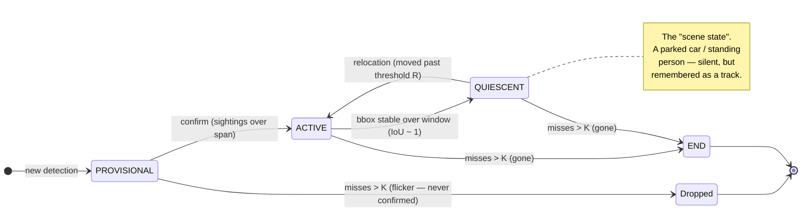
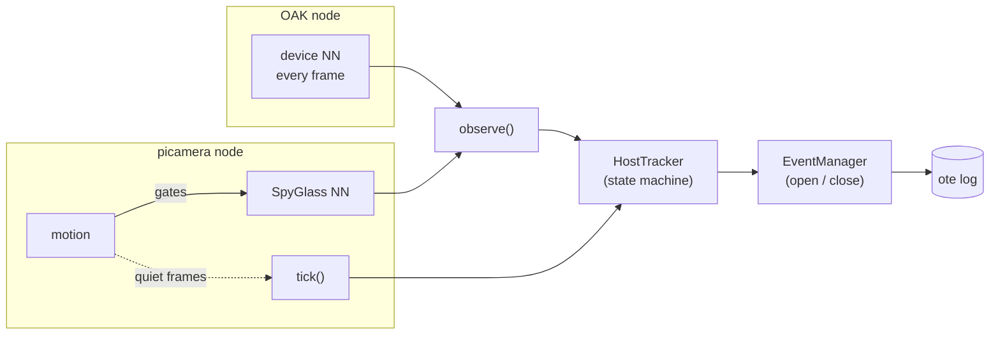
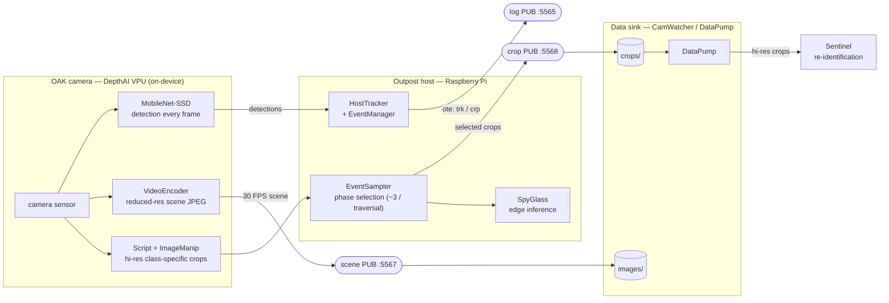

# Tracking & Event-Management Architecture

> **The one idea:** events are driven by *what a subject is doing*, not by raw motion.

A single, persistent, **source-agnostic tracker** holds every subject in view as a
*track* with a small state machine. Events open and close on **state transitions**,
not on motion rectangles. Motion is demoted to a *scheduler* (it decides which
frames are worth an inference) or removed entirely (on the OAK, the device NN runs
every frame). The same tracker and event manager serve every camera node — only the
detection feed differs.

This replaced an older model in which motion drove events directly and a cascade of
correlation trackers tried to follow objects frame-to-frame. That approach could not
tell a *parked car* from a *new arrival*, and it fragmented a single subject into a
storm of events whenever detection flickered. The design below makes the parked car
a quiet, remembered part of the scene, and makes a real arrival or departure a clean,
single event.

---

## 1. The subject lifecycle — the story

A subject's whole journey through the field of view, mapped onto track states and the
events they produce:

```
TIME ─────────────────────────────────────────────────────────────────────►

          walks in          stops, lingers           walks off
scene   ░░🚶→░░░░░     ░░░░🚶 (still) ░░░░      ░░←🚶░░░░      ░░░░░░░

track   PROV ▶ ACTIVE ═══════════▶ QUIESCENT ═══════════▶ ACTIVE ▶ END
        confirm        (moving)     (banked, silent)        (relocated)

event        ┏━ OPEN ━━━━━━┓                          ┏━ OPEN ━━━━┓
             ┃ start·trk·… ┃ ──▶ end                  ┃ start·trk ┃ ──▶ end
             ┗━━━━━━━━━━━━━┛                          ┗━━━━━━━━━━━┛
               EVENT #1 “arrival”                        EVENT #2 “departure”
```

Read left to right:

- **Arrival.** A new detection is held as `PROVISIONAL` until it is confirmed by a
  few sightings over a short span — this debounces single-frame flicker. On
  confirmation the track goes `ACTIVE` and an event **opens**.
- **Lingering.** While the subject stops and stands still, its bounding box stops
  moving. Once it has held steady across the quiescence window the track banks to
  `QUIESCENT` — and because no track is `ACTIVE` any longer, the event **closes**.
  The subject has not left; it has simply become part of the *quiet scene*.
- **Departure.** When the subject moves off, its box relocates far enough from where
  it was banked to trip the relocation test. The track returns to `ACTIVE` and a
  **second, separate event** opens — the departure, captured in its own right.

The key insight the picture makes obvious: **an event closes when a subject goes
quiet, not when it leaves**, and a later movement is a fresh event. A standing person
or a parked car costs nothing and holds nothing open.

---

## 2. The state machine — the rules



Four states, and two subtle rules that carry the whole design:

- **Flicker rejection** (`PROVISIONAL → Dropped`). A detection that never confirms —
  a one-frame ghost, a low-confidence blink — is dropped and never becomes an event.
- **Relocation gating** (`QUIESCENT → ACTIVE`). A banked track re-opens an event only
  when it has genuinely *moved* (its box drifts below the relocation-IoU threshold
  against where it was banked) — not merely jittered. This is what keeps a parked car
  silent through wind, glare, and autofocus hunting, while still catching it the
  moment it actually pulls away.

**Event semantics** (handled by the event manager, which reacts to these
transitions): an event **opens** on any `→ ACTIVE` transition (an arrival or a
relocation); it **closes** when no track remains `ACTIVE` (all subjects have either
ended or banked to `QUIESCENT`).

The thresholds (`confirm` count/span, quiescence IoU & window, relocation IoU `R`,
gap-misses `K`, and the detection admission floor) are per-camera tunables, set in
each node's configuration.

---

## 3. One lifecycle, two node types — the architecture

The tracker and event manager are **source-agnostic**. The only difference between an
OAK node and a picamera node is *how detections reach the tracker*:



- **OAK** runs the neural net on-device every frame, so it simply calls `observe()`
  on each frame — motion is not needed at all.
- **picamera** cannot run the NN every frame on the Pi CPU, so **motion schedules the
  inferences**: a motion frame triggers a SpyGlass detection → `observe()`, while
  quiet frames advance the tracker's clock with `tick()` (never a false "saw nothing",
  which would gap-out a standing subject).
- Both feed the **same** `HostTracker` → `EventManager` → `ote` log. One state machine,
  one event model, two detection sources.

---

## 4. The OAK capture pipeline — three streams

Section 3 covered how detections reach the tracker. This is the wider data-plane view on an
OAK node: the device produces three streams in parallel, the host routes each to where it
belongs, and the crop stream is the high-resolution ground truth the re-identification
pipeline is built on (the detail a plain camera cannot provide).



- The **scene stream** (reduced resolution, hardware-JPEG) drives live viewing and replay,
  and is stored by CamWatcher under `images/`.
- The **detection stream** feeds the source-agnostic tracker (section 3) and the `trk` /
  `crp` records on the `ote` log.
- The **crop stream** is the new capability: high-resolution, class-specific crops cut
  on-device, sampled by phase, stored under `crops/`, and served by DataPump to the
  Sentinel for re-identification — with selected crops also inspected close to the source by
  the `SpyGlass`. A picamera node runs the same lifecycle but produces only the scene and
  detection streams.

---

## Where this lives in the code

| Concept | Implementation |
|---|---|
| State machine, tracks, transitions | `imagenode/.../hosttracker.py` (`HostTracker`) |
| Event open/close, `ote` records | `imagenode/.../eventmanager.py` (`EventManager`) |
| OAK detection feed (device drain) | `imagenode/.../outpost_intake.py` (`OutpostIntake`) |
| OAK device pipeline (scene / detections / crops) + crop selection | `imagenode/.../oak_camera.py`, `imagenode/.../eventsampler.py`; device setups in `depthai.yaml` |
| picamera feed (motion-scheduled observe/tick) | `imagenode/.../picamera_intake.py` (`PicameraIntake`) |
| Per-camera thresholds | each node's `host_vars` `detector.tracker` block — field reference + tuning guidance in [OUTPOST_CONFIGURATION.md](OUTPOST_CONFIGURATION.md) |

> **Diagram sources.** Panels 2, 3, and 4 are Mermaid (rendered inline). The lifecycle
> timeline (panel 1) is kept as ASCII here; if a polished render is wanted it can be
> promoted to an SVG/PNG in `docs/images/` alongside the other architecture figures.
